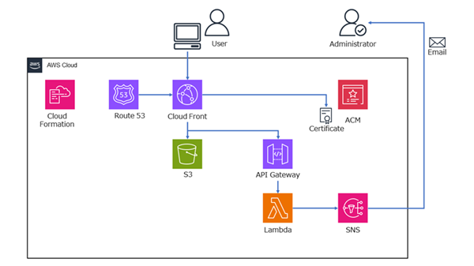

\# AWS Portfolio (Serverless / IoT)


AWS を中心としたクラウド技術の検証・成果物をまとめたポートフォリオリポジトリです。  

本リポジトリでは、\*\*CloudFormation による IaC 管理\*\*を前提とした

サーバーレス Web アプリケーションと AWS IoT デモシステムを公開しています。


▶ ポートフォリオサイト  

https://portfolio-suzuki.com/


---


\## 📌 成果物一覧


\- ① サーバーレス Web アプリケーション（本ポートフォリオサイト）

\- ② AWS IoT デモ（環境センサーデバイス模擬）


---


\## ① サーバーレス Web アプリケーション


本ポートフォリオサイトの AWS 構成です。  

CloudFront を中心に、静的コンテンツと API を分離した

\*\*完全サーバーレス構成\*\*を採用しています。


---


\### 🔧 構成概要


\- CloudFront + S3：静的サイト配信

\- API Gateway + Lambda（Python）：動的処理

\- SNS：問い合わせ内容の通知

\- Route53 / ACM：独自ドメイン管理・HTTPS 化

\- CloudFormation：全リソースを IaC 管理


---


\### 🏗️ アーキテクチャ構成図




\## 🧠 設計ポイント


\- サーバーレス構成により運用負荷とコストを低減

\- ビルド不要な構成とし、構成をシンプルに維持

\- CloudFormation により再現性・保守性を重視


### 📁 関連ディレクトリ

```text
aws-serverless-portfolio/
├─ cloudformation/
│  ├─ apigateway-template.yaml
│  ├─ cloudfront-template.yaml
│  ├─ iam-template.yaml
│  ├─ lambda-template.yaml
│  ├─ route53-template.yaml
│  ├─ s3-template.yaml
│  └─ sns-template.yaml
└─ lambda/
    └─ lambda_function.py
```


\## ② AWS IoT デモ（環境センサーデバイス模擬）


AWS IoT Core を使用した IoT デモシステムです。  

IoT デバイスから送信されるデータの保存と、

\*\*異常発生時の可視化\*\*を目的としています。


\### 🔧 構成概要


\- EC2 + Python：IoT デバイス模擬

\- AWS IoT Core（MQTTS）：データ受信

\- IoT Rule：DynamoDB / Lambda へ連携

\- DynamoDB：センサーデータ保存

\- CloudWatch：異常データの可視化

\- CloudFormation：IoT 証明書を除く全リソースを管理


\### 🧠 デモ内容


\- 温度・CO2・バッテリー残量などのダミーデータを生成

\- 閾値超過時に status を `alert` に変更

\- alert データのみ Lambda を起動し、CloudWatch Metrics へ送信

\- CloudWatch Dashboard で異常発生状況を可視化

### 📁 関連ディレクトリ

```text
aws-iot-demo/
├─ cloudformation/
│  ├─ iot-demo.yaml
│  ├─ awsiot-template.yaml
│  ├─ cloudwatch-template.yaml
│  ├─ dynamodb-template.yaml
│  ├─ iam-template.yaml
│  ├─ lambda-template.yaml
│  └─ vpc-ec2-template.yaml
├─ lambda/
│  └─ lambda_function.py
└─ device/
    └─ sensor_simulator.py
```


