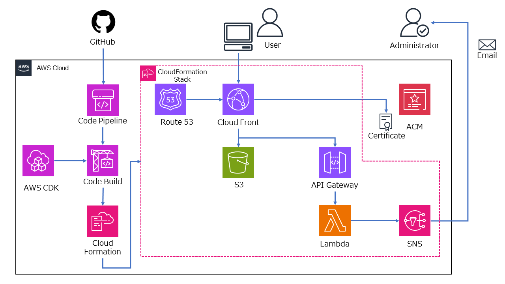
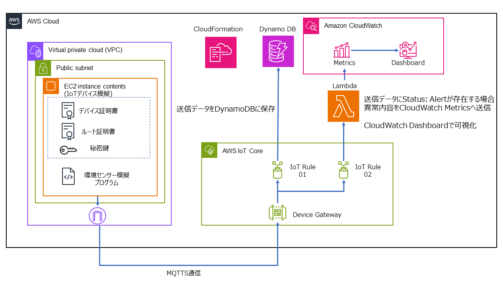

# AWS Portfolio (Serverless / DevOps / IoT)

AWS を中心とした **設計・構築（IaC）/ CI/CD / 運用観点** の検証・成果物をまとめたポートフォリオリポジトリです。  
サーバーレス Web アプリケーション（本ポートフォリオサイト）と、AWS IoT デモシステムを掲載しています。

- 主軸：**IaC（CloudFormation / AWS CDK）**
- デプロイ：**CI/CD（GitHub → CodePipeline/CodeBuild → CloudFormation）**
- 運用：問い合わせ通知（SNS）などの運用要素を含む

▶ ポートフォリオサイト  
https://portfolio-suzuki.com/

---


\## 📌 成果物一覧


\- ① サーバーレス Web アプリケーション（ポートフォリオサイト）

\- ② AWS IoT デモ（環境センサーデバイス模擬）


---


\## ① サーバーレス Web アプリケーション


CDK、CloudFront を中心に、静的コンテンツと API を分離した **サーバーレス構成** です。  
インフラは IaC 化しており、変更を GitHub 起点で CI/CD により反映します。

旧構成ではCloudFormationテンプレートを使用してのデプロイですが、現構成でCDK使用に変更しました。


---


\### 🔧 構成概要


- CloudFront + S3：静的サイト配信
- API Gateway + Lambda（Python）：問い合わせフォーム等の API
- SNS：問い合わせ内容の通知
- Route53 / ACM：独自ドメイン管理・HTTPS 化
- IaC：CloudFormation / AWS CDK
- CI/CD：GitHub → CodePipeline / CodeBuild → CloudFormation（スタック更新）


---


\### 🏗️ アーキテクチャ構成図




---


\## 🧠 設計ポイント


- サーバーレス構成により運用負荷・コストを抑えつつスケーラブルに設計
- IaC により再現性を確保し、変更容易性を重視
- デプロイは差分を意識した運用（Change Set / Manual Approval）を想定


---

### 📁 関連ディレクトリ

```text
aws-serverless-portfolio/
├─README.md
└─ CDK/
    ├─ app.py
    ├─ cdk.json
    ├─ requirements-dev.txt
    ├─ requirements.txt
    ├─ tests/
    │   ├─__init__.py
    │   └─unit/
    │       ├─__init__.py
    │       └─test_cdk_python_stack.py
    └─ cdk_python/
            ├─__init__.py
            ├─backend_stack.py
            ├─frontend_stack.py
            └─constructs
                ├─__init__.py
                ├─apigateway.py
                ├─cloudfront.py
                ├─lambda_function.py
                ├─route53.py
                ├─s3_bucket.py
                └─sns_topic.py

```

### 📁 関連ディレクトリ(旧構成:CloudFormationコード)

```text
(old)aws-serverless-portfolio/
├─ cloudformation/
│  ├─ apigateway-template.yaml
│  ├─ cloudfront-template.yaml
│  ├─ iam-template.yaml
│  ├─ lambda-template.yaml
│  ├─ route53-template.yaml
│  ├─ s3-template.yaml
│  └─ sns-template.yaml
└─ lambda/
    └─ lambda_function.py
```


\## ② AWS IoT デモ（環境センサーデバイス模擬）


AWS IoT Core を使用した IoT デモシステムです。  

IoT デバイスから送信されるデータの保存と、

\*\*異常発生時の可視化\*\*を目的としています。


---


\### 🔧 構成概要


\- EC2 + Python：IoT デバイス模擬

\- AWS IoT Core（MQTTS）：データ受信

\- IoT Rule：DynamoDB / Lambda へ連携

\- DynamoDB：センサーデータ保存

\- CloudWatch：異常データの可視化

\- CloudFormation：IoT 証明書を除く全リソースを管理


---

\### 🏗️ アーキテクチャ構成図




---


\### 🧠 設計ポイント


\- 温度・CO2・バッテリー残量などのダミーデータを生成

\- 閾値超過時に status を `alert` に変更

\- alert データのみ Lambda を起動し、CloudWatch Metrics へ送信

\- CloudWatch Dashboard で異常発生状況を可視化


---


### 📁 関連ディレクトリ

```text
aws-iot-demo/
├─ cloudformation/
│  ├─ iot-demo.yaml
│  ├─ awsiot-template.yaml
│  ├─ cloudwatch-template.yaml
│  ├─ dynamodb-template.yaml
│  ├─ iam-template.yaml
│  ├─ lambda-template.yaml
│  └─ vpc-ec2-template.yaml
├─ lambda/
│  └─ lambda_function.py
└─ device/
    └─ sensor_simulator.py
```


