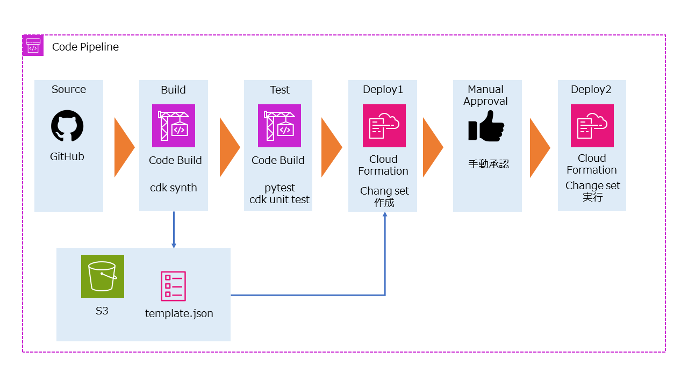

# AWS CDK Infrastructure

本ディレクトリは、ポートフォリオサイト（サーバーレス Web アプリケーション）の  
**AWS インフラ構成を AWS CDK（Python）で管理するためのコード**です。

CloudFormation テンプレートを直接管理していた構成から、  
**再利用性・保守性・変更容易性の向上**を目的として CDK へ移行しています。

---

## 🎯 目的

- サーバーレス Web アプリケーションのインフラを IaC で管理
- GitHub 起点の CI/CD パイプラインから安全にデプロイ可能な構成とする
- CloudFormation Change Set を用いた **差分確認・手動承認を前提とした運用**を想定

---

## 🏗️ 管理対象リソース

本 CDK スタックでは、以下の AWS リソースを管理しています。

- CloudFront
- S3（静的コンテンツ格納）
- API Gateway
- Lambda（Python）
- SNS（問い合わせ通知）
- Route53
- ACM
- IAM（最小権限）

---

## 🧩 ディレクトリ構成（例）

```text
CDK/
├─ app.py                 # CDK アプリケーションのエントリポイント
├─ cdk.json               # Context / 設定値
├─ requirements.txt       # CDK 実行用依存関係
├─ requirements-dev.txt   # 開発・テスト用依存関係
├─ tests/
│  └─ unit/
│      └─ test_cdk_python_stack.py  # CDK スタックのユニットテスト
└─ cdk_python/
    ├─ frontend_stack.py  # フロントエンドスタック(CloudFront / S3 / Route53)
    ├─ backend_stack.py   # バックエンドスタック(API Gateway / Lambda / SNS)
    └─ constructs/
        ├─ cloudfront.py
        ├─ s3_bucket.py
        ├─ apigateway.py
        ├─ lambda_function.py
        ├─ sns_topic.py
        └─ route53.py
```

## 🔄 CI/CD デプロイフロー

本構成では、AWS CDK を用いたインフラ更新を
以下の CI/CD フローで実施します。



### 各ステージの役割

- Source  
  GitHub への push をトリガーにパイプラインを起動

- Build  
  CodeBuild にて `cdk synth` を実行し、
  CloudFormation テンプレートを生成

- Test  
  pytest による CDK スタックのユニットテストを実行

- Deploy（Change Set 作成）  
  CloudFormation Change Set を作成

- Manual Approval  
  人手で承認

- Deploy（Change Set 実行）  
  承認後にスタックを更新


